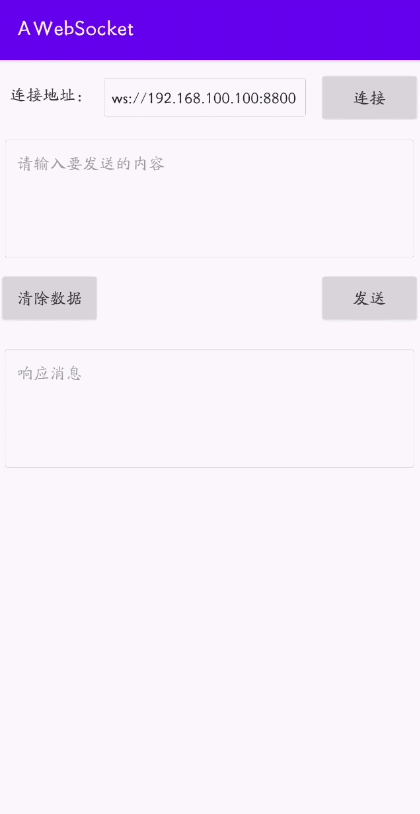

# AWebSocket

[](https://raw.githubusercontent.com/jenly1314/AWebSocket/master/app/release/app-release.apk)
[](https://repo1.maven.org/maven2/com/github/jenly1314/awebsocket)
[](https://jitpack.io/#jenly1314/AWebSocket)
[](https://circleci.com/gh/jenly1314/AWebSocket)
[](https://android-arsenal.com/api?level=21)
](http://www.apache.org/licenses/LICENSE-2.0)
[](https://jenly1314.github.io/)
[](http://shang.qq.com/wpa/qunwpa?idkey=8fcc6a2f88552ea44b1411582c94fd124f7bb3ec227e2a400dbbfaad3dc2f5ad)

AWebSocket for Android 一个基于okhttp封装的 **WebSocket**，简洁易用。

## Gif 展示



>
你也可以直接下载 [演示App](https://raw.githubusercontent.com/jenly1314/AWebSocket/master/app/release/app-release.apk)
体验效果

## 引入

### Gradle:

1. 在Project的 **build.gradle** 或 **setting.gradle** 中添加远程仓库

    ```gradle
    repositories {
        //...
        mavenCentral()
    }
    ```

2. 在Module的 **build.gradle** 里面添加引入依赖项
    ```gradle
    implementation 'com.github.jenly1314:awebsocket:1.0.0'
    
    ```

## 使用

### 主要使用示例

```kotlin
//初始化AWebSocket
val aWebSocket = AWebSocket(url)
// 设置监听
aWebSocket.setWebSocketListener(object : WebSocketListener() {
    override fun onOpen(webSocket: IWebSocket, response: Response) {
        super.onOpen(webSocket, response)
        // TODO 连接成功，可以进⾏通信了
    }

    override fun onMessage(webSocket: IWebSocket, text: String) {
        super.onMessage(webSocket, text)
        // TODO 接收消息
    }

    override fun onMessage(webSocket: IWebSocket, bytes: ByteString) {
        super.onMessage(webSocket, bytes)
        // TODO 接收消息
    }

    override fun onClosing(webSocket: IWebSocket, code: Int, reason: String) {
        super.onClosing(webSocket, code, reason)
        // TODO 连接关闭中
    }

    override fun onClosed(webSocket: IWebSocket, code: Int, reason: String) {
        super.onClosed(webSocket, code, reason)
        // TODO 连接已关闭
    }

    override fun onFailure(webSocket: IWebSocket, t: Throwable, response: Response?) {
        super.onFailure(webSocket, t, response)
        // TODO 连接出错
    }
})

// 连接
aWebSocket.connect()

//---------------------------

//...
// 发送消息
aWebSocket.send(data)

//---------------------------

//...
// 关闭连接
aWebSocket.close()

```

更多使用详情，请查看[Demo](app)中的源码使用示例或直接查看[API帮助文档](https://jitpack.io/com/github/jenly1314/AWebSocket/latest/javadoc/)

### 相关推荐

#### [ANetty](https://github.com/jenly1314/ANetty) 基于Netty封装的Android链路通讯库，用以快速开发高性能，高可靠性的网络交互。在保证易于开发的同时还保证其应用的性能，稳定性和伸缩性。
#### [ASocket](https://github.com/jenly1314/ASocket) 一个TCP/UDP协议的封装库，方便快速实现TCP的长连接与UDP的单播、组播、广播等相关通信。

## 版本记录

#### v1.0.0：2023-11-12

* AWebSocket初始版本

## 赞赏

如果你喜欢AWebSocket，或感觉AWebSocket帮助到了你，可以点右上角“Star”支持一下，你的支持就是我的动力，谢谢 :
smiley:<p>
你也可以扫描下面的二维码，请作者喝杯咖啡 :coffee:
<div>


</div>

## 关于我

Name: <a title="关于作者" href="https://jenly1314.github.io" target="_blank">Jenly</a>

Email: <a title="欢迎邮件与我交流" href="mailto:jenly1314@gmail.com" target="_blank">
jenly1314#gmail.com</a> / <a title="给我发邮件" href="mailto:jenly1314@vip.qq.com" target="_blank">
jenly1314#vip.qq.com</a>

CSDN: <a title="CSDN博客" href="http://blog.csdn.net/jenly121" target="_blank">jenly121</a>

CNBlogs: <a title="博客园" href="https://www.cnblogs.com/jenly" target="_blank">jenly</a>

GitHub: <a title="GitHub开源项目" href="https://github.com/jenly1314" target="_blank">jenly1314</a>

Gitee: <a title="Gitee开源项目" href="https://gitee.com/jenly1314" target="_blank">jenly1314</a>

加入QQ群: <a title="点击加入QQ群" href="http://shang.qq.com/wpa/qunwpa?idkey=8fcc6a2f88552ea44b1411582c94fd124f7bb3ec227e2a400dbbfaad3dc2f5ad" target="_blank">
20867961</a>
   <div>
       
       
   </div>


   
