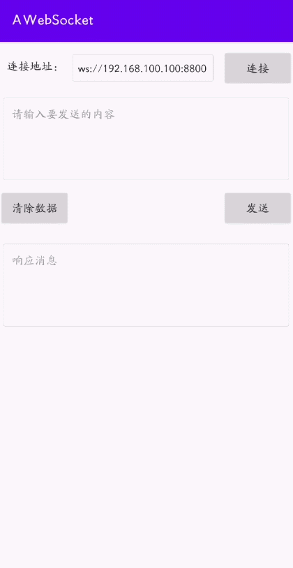

# AWebSocket

[](https://repo1.maven.org/maven2/com/github/jenly1314/AWebSocket)
[](https://jitpack.io/#jenly1314/AWebSocket)
[](https://github.com/jenly1314/AWebSocket/actions/workflows/build.yml)
[](https://raw.githubusercontent.com/jenly1314/AWebSocket/master/app/release/app-release.apk)
[](https://developer.android.com/guide/topics/manifest/uses-sdk-element#ApiLevels)
[](https://opensource.org/licenses/LICENSE-2-0)


AWebSocket for Android 一个基于okhttp封装的 **WebSocket**，简洁易用。

## 效果展示



> 你也可以直接下载 [演示App](https://raw.githubusercontent.com/jenly1314/AWebSocket/master/app/release/app-release.apk)体验效果

## 引入

### Gradle:

1. 在Project的 **build.gradle** 或 **setting.gradle** 中添加远程仓库

    ```gradle
    repositories {
        //...
        mavenCentral()
    }
    ```

2. 在Module的 **build.gradle** 中添加依赖项
    ```gradle
    implementation 'com.github.jenly1314:awebsocket:1.0.0'

    ```

## 使用

### 使用示例

```kotlin
// 初始化AWebSocket
val aWebSocket = AWebSocket(url)
// 设置监听
aWebSocket.setWebSocketListener(object : WebSocketListener() {
    override fun onOpen(webSocket: IWebSocket, response: Response) {
        super.onOpen(webSocket, response)
        // TODO 连接成功，可以进⾏通信了
    }

    override fun onMessage(webSocket: IWebSocket, text: String) {
        super.onMessage(webSocket, text)
        // TODO 接收消息
    }

    override fun onMessage(webSocket: IWebSocket, bytes: ByteString) {
        super.onMessage(webSocket, bytes)
        // TODO 接收消息
    }

    override fun onClosing(webSocket: IWebSocket, code: Int, reason: String) {
        super.onClosing(webSocket, code, reason)
        // TODO 连接关闭中
    }

    override fun onClosed(webSocket: IWebSocket, code: Int, reason: String) {
        super.onClosed(webSocket, code, reason)
        // TODO 连接已关闭
    }

    override fun onFailure(webSocket: IWebSocket, t: Throwable, response: Response?) {
        super.onFailure(webSocket, t, response)
        // TODO 连接出错
    }
})

// 连接
aWebSocket.connect()

//---------------------------

//...
// 发送消息
aWebSocket.send(data)

//---------------------------

//...
// 关闭连接
aWebSocket.close()

```

更多使用详情，请查看[app](app)中的源码使用示例或直接查看[API帮助文档](https://jenly1314.github.io/AWebSocket/api/)

## 相关推荐

- [ANetty](https://github.com/jenly1314/ANetty) 基于Netty封装的Android链路通讯库，用以快速开发高性能，高可靠性的网络交互。在保证易于开发的同时还保证其应用的性能，稳定性和伸缩性。
- [ASocket](https://github.com/jenly1314/ASocket) 一个TCP/UDP协议的封装库，方便快速实现TCP的长连接与UDP的单播、组播、广播等相关通信。

<!-- end -->

## 版本日志

#### v1.0.0：2023-11-12
* AWebSocket初始版本

---


